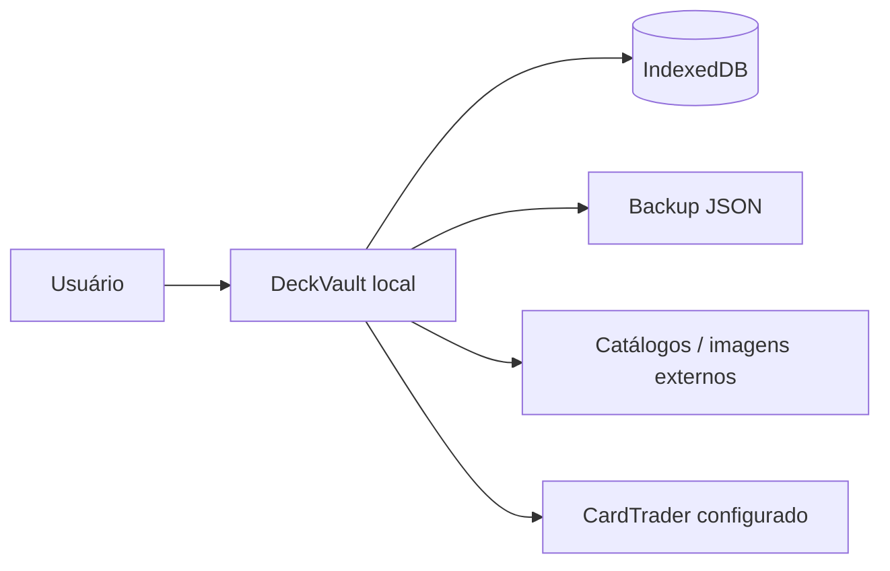

# DeckVault — MVP atual

**Produto:** gestor local de coleção TCG (Yu-Gi-Oh!, Pokémon, Digimon) + Anime Collection opcional.

## Objetivo

Permitir que um colecionador:

1. Organize várias coleções e cartas.
2. Pesquise, adicione, importe e exporte cartas/decks.
3. Use visualização grid, binder, tabela e compacta.
4. Use Anime Collection por série/personagem.
5. Consulte indicadores de compras do CardTrader quando configurado.
6. Imprima proxies.
7. Faça backup e restauração por arquivo JSON.

## Dados

- Não há conta obrigatória.
- Não há Supabase ou banco PostgreSQL no fluxo atual.
- Não há sincronização entre PCs.
- Para mover dados entre computadores, use backup JSON.

## Em escopo

- Coleção TCG e múltiplas coleções.
- Quick Add, pesquisa e importação.
- Exportação TXT/CSV/YDK/YDKE.
- Binder e ordenação.
- Anime Collection.
- Activity local + undo.
- Proxy print.
- Configurações, IndexedDB e backup.
- Programa Windows e atualização local.

## Fora de escopo

- Autenticação/contas.
- Cloud sync.
- Compartilhamento, membros ou convites.
- Presence realtime.
- Comunidade, trading, notificações e gráficos de preço.

## Critérios de pronto

- [x] Funciona sem conta.
- [x] Dados persistem em IndexedDB.
- [x] Adicionar/ver/editar/remover cartas.
- [x] Import/export básicos.
- [x] Backup JSON + restore.
- [x] Anime Collection offline.
- [x] Proxy print.
- [x] Activity local + undo.
- [x] Aplicativo Windows funcional.
